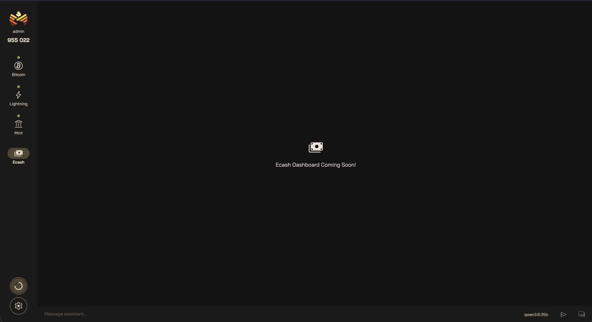

import { Aside, CardGrid, LinkCard } from '@astrojs/starlight/components';

Ecash is the product your mint exists to issue — the bearer tokens wallets hold and spend,
backed one-to-one by the bitcoin behind your stack. The Ecash view is its dedicated home in
Orchard, set apart from the [Mint](/orchard/mint/) view that operates the daemon issuing it.

<figure class="screenshot">

<figcaption>The dedicated Ecash view — a full dashboard is on the way.</figcaption>

</figure>

## Dashboard

A dedicated Ecash dashboard is coming soon. In the meantime, the [Mint](/orchard/mint/) view
already surfaces the ecash side of your mint:

- The [**Dashboard** tab](/orchard/mint/#dashboard)'s "Nutalytics" charts plot ecash counts
  alongside balances, mints, melts, swaps, and fee revenue across a date range you choose.
- The [**Keysets** tab](/orchard/mint/#keysets) lists every keyset your mint issues ecash
  against — its balance, fee revenue, and proof and promise counts.
