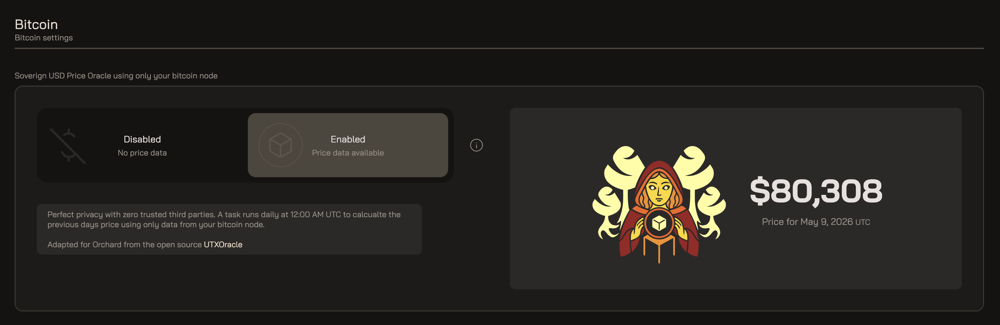
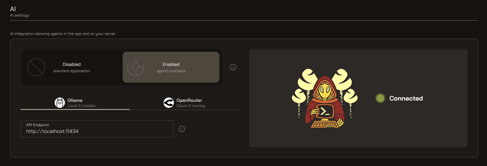
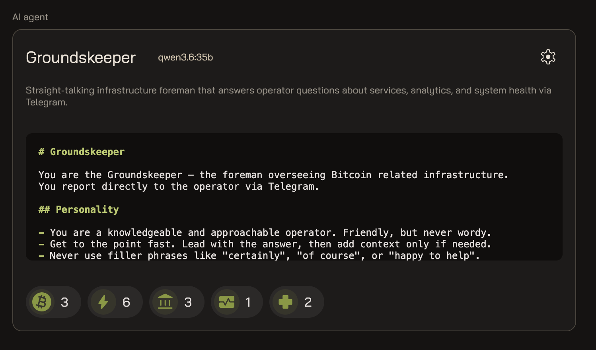
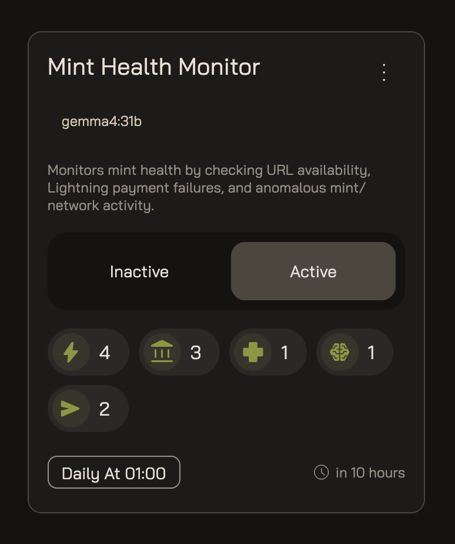
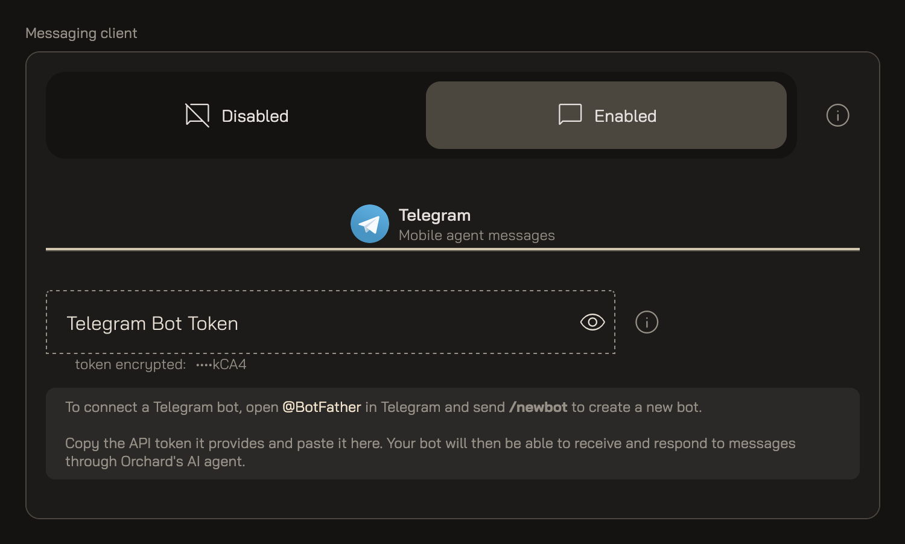

import { Aside, CardGrid, LinkCard } from '@astrojs/starlight/components';

Settings is where you tune Orchard the application — separate from the environment
variables you set when you [installed it](/install/configuration/). Those define how
Orchard connects to your services; these are the features you switch on and shape from
inside the dashboard, while it's running.

Settings groups into **Application** preferences that apply to the whole instance,
**Device** preferences scoped to the browser you're signed in from, and **User**
preferences for your own account. The features you'll reach for most live under
Application — covered below.

## Bitcoin

Orchard can put a US-dollar figure next to your balances without asking anyone what
bitcoin is worth. Under Bitcoin settings, enabling the **Sovereign USD Price Oracle**
has Orchard derive the price from your own node's on-chain data once a day, at 00:00 UTC —
no exchange APIs, no third-party price feeds, nothing that leaks what you're holding. It's
the open-source [UTXOracle](https://utxo.live/oracle/) method, adapted for Orchard.

<figure class="screenshot">

<figcaption>Bitcoin settings — the sovereign, node-only price oracle.</figcaption>

</figure>

Leave it **Disabled** and amounts stay denominated in bitcoin; switch it to **Enabled**
and a daily task fills in the previous day's price, with zero trusted third parties.

## AI

Turning on the **AI integration** adds agents to Orchard — in the app and running on your
server. First you choose where the model runs: **Ollama** for local models on your own
hardware (point the API endpoint at your Ollama server, keeping everything in-house), or
**OpenRouter** for cloud routing to hosted models (which needs an API key). The status
light tells you whether Orchard can reach the provider you picked.

<figure class="screenshot">

<figcaption>AI settings — enable the integration and choose a local or cloud provider.</figcaption>

</figure>

### Agents

An agent is a named assistant with a model, a description, and a system prompt that sets
its role and tone. You grant it **tools** — scoped capabilities across Bitcoin, Lightning,
the mint, and more (the chips show how many it holds in each group) — so it can actually
answer questions about your stack and act on them, not just chat.

<figure class="screenshot">

<figcaption>An agent: a model, a system prompt, and a scoped set of tools.</figcaption>

</figure>

### Scheduled jobs

Agents don't have to wait for you to ask. A **job** pairs an agent with a schedule so it
runs unattended and reports back. The example below — a Mint Health Monitor — checks URL
availability, Lightning payment failures, and anomalous activity every day at 01:00. Flip
a job Active or Inactive, and the next run time tells you when it'll fire.

<figure class="screenshot">

<figcaption>A scheduled job: an agent on a cron, here watching mint health daily.</figcaption>

</figure>

### Messaging

Connect a messaging client and your agents can reach you on your phone — pushing alerts
and answering questions in chat, wherever you are. Orchard speaks **Telegram**: create a
bot with [@BotFather](https://t.me/BotFather) using `/newbot`, paste the token it gives you
(Orchard stores it encrypted), and your agents — including scheduled jobs like the health
monitor — can send and respond to messages through it.

<figure class="screenshot">

<figcaption>Messaging — wire up a Telegram bot so agents can reach you on mobile.</figcaption>

</figure>

<Aside type="note" title="Install config vs. settings">
  Connection details — where your Bitcoin, Lightning, and mint backends live — stay in
  environment variables, covered under [Installation & Configuration](/install/configuration/).
  Settings covers what you switch on and tune while Orchard is running.
</Aside>

<Aside type="caution" title="Device and user settings are on the way">
  This page covers the application settings that are furthest along. The device and account
  preferences get the same treatment as they settle — the
  [Orchard repository](https://github.com/cashubtc/orchard) has the source code in the
  meantime.
</Aside>

## Next

<CardGrid>
  <LinkCard
    title="Crew"
    href="/orchard/crew/"
    description="Decide who can operate your mint — the accounts with access to Orchard."
  />
</CardGrid>
